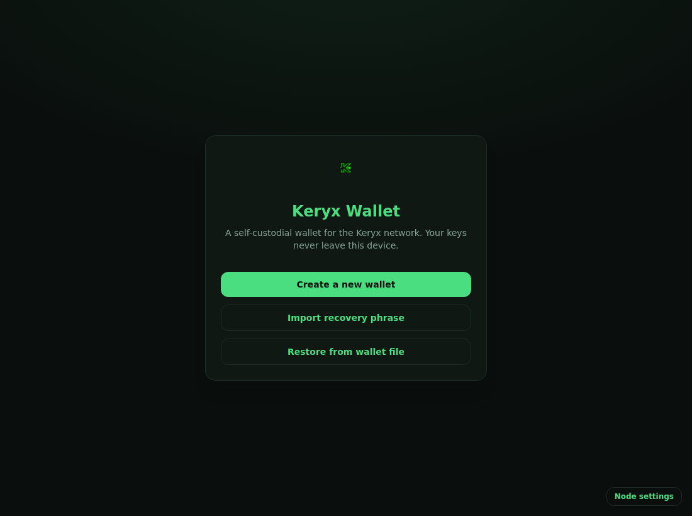

# Keryx Wallet

A lightweight, self-custodial desktop wallet for the **Keryx** network, available for **Linux** and **Windows**.

Your keys never leave your device. The recovery phrase is encrypted at rest, and every spend is confirmed and signed locally — the wallet only talks to a Keryx node to read balances and broadcast transactions.

<p align="center">
  
</p>

## Features

- **Create or import** a wallet from a 24-word recovery phrase, with on-screen backup confirmation.
- **Password unlock** with automatic lock on inactivity.
- **Dashboard** showing mature and pending balance alongside transaction history.
- **Send** with address and network validation, fee estimation, and an explicit confirmation step.
- **Receive** with a copyable address and QR code.
- **Configurable node endpoint** (wRPC), so you can point the wallet at your own node.

## Requirements

- A reachable Keryx node wRPC (Borsh) endpoint — default `ws://127.0.0.1:23110` — started with `--utxoindex`.
- For development: Node 20+, Rust (stable), and the Tauri Linux dependencies:
  `libwebkit2gtk-4.1-dev`, `libgtk-3-dev`, `libayatana-appindicator3-dev`, `librsvg2-dev`.

## Getting started (development)

```bash
npm install
npm run tauri dev      # launches the app against your configured node
```

## Building installers

### Linux (local)

```bash
npm run tauri build                    # all available Linux bundles
npm run tauri build -- --bundles deb   # just the .deb
# output: src-tauri/target/release/bundle/
```

### Windows + Linux (via CI)

Windows installers are produced by **GitHub Actions**. Push a version tag and the release workflow
builds the installers and attaches them to a **draft** GitHub Release for review:

```bash
git tag v0.1.0
git push origin v0.1.0
```

- Windows: `.msi` (WiX) and `.exe` (NSIS). Linux: `.deb` and `.AppImage`.
- See `.github/workflows/release.yml`. The release is created as a draft — review and publish manually.

## Architecture

The wallet is a small native shell built with **Tauri v2**, a **React + TypeScript** frontend styled
with **Tailwind**, and the **Keryx wallet-core** compiled to WebAssembly (`src/sdk/`). The cryptography
is the upstream wallet library rather than a reimplementation, so key handling matches the rest of the
ecosystem. Regenerating the SDK from a newer node release is documented in `SDK_CONTRACT.md`.

## Security

- The recovery phrase is encrypted at rest (Argon2 key derivation, XChaCha20-Poly1305 encryption) and
  is never written to logs. Keys are derived in memory only, and the password is requested again for
  every send.
- A send freezes the confirmed amounts — what you confirm is exactly what is signed — and validates the
  destination address and network beforehand.
- A strict Content Security Policy blocks remote content and inline/eval scripts, and Tauri capabilities
  are limited to the defaults.

## License

MIT — see [`LICENSE`](LICENSE).
