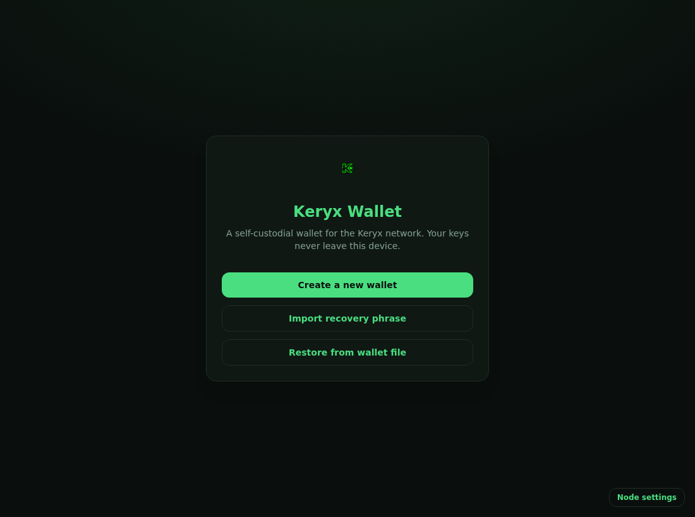

# Keryx Wallet

A lightweight, self-custodial desktop wallet for the **Keryx** network, available for **macOS**, **Linux**, and **Windows**. It holds your KRX, and it lets you **ask the network's AI models a question directly from the wallet**: uncensored inference, paid on-chain, answered by miners.

Your keys never leave your device. The recovery phrase is encrypted at rest, and every spend is confirmed and signed locally; the wallet only talks to a Keryx node to read balances and broadcast transactions.

<p align="center">
  
</p>

## Download

Prebuilt binaries are attached to each [GitHub Release](../../releases):

- **macOS:** `.dmg` (drag to Applications) or the `.app` bundle. A single **universal** build runs natively on both Apple Silicon and Intel Macs.
- **Windows:** `.msi` or `.exe` installer, or the standalone **portable** `.exe` (no install, just run it).
- **Linux:** `.deb` or `.AppImage`.

> **macOS note:** the release is currently **unsigned**. On first launch Gatekeeper will warn that the app is from an unidentified developer — right-click the app → **Open** → **Open** to run it. (The release workflow is wired for Apple code signing + notarization via `APPLE_*` repository secrets, so a maintainer with an Apple Developer ID can enable a signed build without code changes.)

## Ask the network: AI inference from the wallet

Keryx miners run open language models alongside proof-of-work, and any wallet can put a question to them. From Home, **Ask the network · AI inference** opens a chat:

1. **Pick a model** from the current lineup (Qwen3.5-9B, GLM-4-9B, Gemma-4-12B, Qwen3.6-27B, Kimi-Linear-48B, all uncensored) and a token budget.
2. **See the exact cost** before sending: the model's consensus-enforced minimum reward plus a small burned network fee, from about 1 KRX per request.
3. **Submit.** The wallet builds an `AiRequest` transaction, locks the reward in the chain's keyless vault, signs it locally and broadcasts it. The first miner to serve the request is paid by the chain itself; nobody else can claim the reward.
4. **Read the answer in the chat.** The wallet watches the chain for the miner's `AiResponse`, fetches the text from IPFS and renders it inline, with a link to the raw result.

Requests are public: they appear on the explorer's inference livefeed. Nothing is sent unless a miner is currently serving the chosen model, and the wallet checks that on-chain before every submission. All of this goes through the wallet's node connection; no account, no API key.

## Features

- **Ask the network:** on-chain AI inference from the wallet (see above).
- **Create or import** a wallet from a 24-word recovery phrase, with on-screen backup confirmation.
- **Several wallets** in one app, switchable from the unlock screen, each with its own alias.
- **Password unlock** with automatic lock on inactivity.
- **Dashboard** showing mature and pending balance alongside transaction history.
- **Send** with address and network validation, fee estimation, and an explicit confirmation step.
- **Receive** with a copyable address and QR code.
- **Mining status** on the address card for mining addresses: holder-reward bracket, 24h production, next rung and service standing, read from the explorer API.
- **Authorise a miner:** sign the escrow delegation a miner needs to mine to your address (Settings).
- **Public node by default**, with a **configurable node endpoint** (wRPC) so you can point the wallet at your own node.

## Requirements

- A reachable Keryx node wRPC (Borsh) endpoint started with `--utxoindex`. By default the wallet uses the Keryx Labs public node (`wss://node.keryx-labs.com:23110` for mainnet, `:23210` for testnet-10); a local node such as `ws://127.0.0.1:23110` can be set in the node settings.
- For development: Node 20+ and Rust (stable), plus the per-OS Tauri dependencies:
  - **macOS:** Xcode Command Line Tools (`xcode-select --install`). To build a universal `.dmg`, add both Rust targets: `rustup target add aarch64-apple-darwin x86_64-apple-darwin`.
  - **Linux:** `libwebkit2gtk-4.1-dev`, `libgtk-3-dev`, `libayatana-appindicator3-dev`, `librsvg2-dev`.
  - **Windows:** the [WebView2 runtime](https://developer.microsoft.com/microsoft-edge/webview2/) (preinstalled on Windows 10/11).

## Getting started (development)

```bash
npm install
npm run tauri dev      # launches the app against your configured node
```

## Building installers

### macOS (local)

```bash
npm run tauri build -- --target universal-apple-darwin   # universal .app + .dmg (Apple Silicon + Intel)
# output: src-tauri/target/universal-apple-darwin/release/bundle/
```

Requires both Rust targets (`rustup target add aarch64-apple-darwin x86_64-apple-darwin`). To build
only for the current Mac, drop `--target` (Apple Silicon produces an aarch64 build; an Intel Mac an
x86_64 build). Pass `--bundles app` or `--bundles dmg` to build just one format.

### Linux (local)

```bash
npm run tauri build                    # all available Linux bundles
npm run tauri build -- --bundles deb   # just the .deb
# output: src-tauri/target/release/bundle/
```

### Windows + Linux + macOS (via CI)

Installers are produced by **GitHub Actions**. Push a version tag and the release workflow
builds the installers and attaches them to a **draft** GitHub Release for review:

```bash
git tag v0.1.0
git push origin v0.1.0
```

- Windows: `.msi` (WiX), `.exe` (NSIS) installer, and a standalone portable `.exe`. Linux: `.deb` and `.AppImage`. macOS: universal `.app` and `.dmg`.
- All artifacts land on a single draft Release (see `.github/workflows/release.yml`). The release stays a draft so you can review it and publish manually.
- macOS builds are **unsigned** unless the `APPLE_*` repository secrets are set (see comments in `release.yml`).

## Architecture

The wallet is a small native shell built with **Tauri v2**, a **React + TypeScript** frontend styled
with **Tailwind**, and the **Keryx wallet-core** compiled to WebAssembly (`src/sdk/`). The cryptography
is the upstream wallet library rather than a reimplementation, so key handling matches the rest of the
ecosystem. Regenerating the SDK from a newer node release is documented in `SDK_CONTRACT.md`.

## Security

- The recovery phrase is encrypted at rest (Argon2 key derivation, XChaCha20-Poly1305 encryption) and
  is never written to logs. Keys are derived in memory only. The password is held while the wallet is
  unlocked so sends and inference requests sign without prompting, and it is dropped on lock or
  auto-lock.
- A send validates the destination address and network first, then freezes the confirmed amounts:
  what you confirm is exactly what gets signed.
- A strict Content Security Policy blocks remote content and inline/eval scripts, and Tauri capabilities
  are limited to the defaults.

## License

MIT. See [`LICENSE`](LICENSE).
